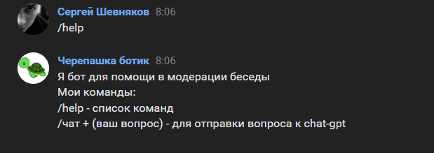
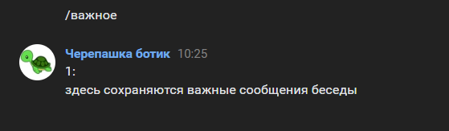
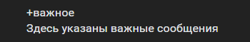
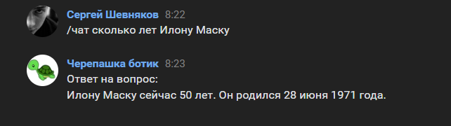

# VK-бот для модерации беседы

## Стек технологий
----------
* Python 3.11
* SQLite
* vk_api
* g4f

## Установка

1. Склонировать к себе https://github.com/Sergey-Shewnyakow/vk_bot
2. В проекте создать файл .env и указать токен "TOKEN= (ваш токен беседы)"
3. В файле configg.py измените admin_id на id администратора
4. Запустить файл main.py

## Команды для бота
* Команда **/help** – выводит информацию о командах бота.

* Команда **/важное** – выводит все важные сообщения сохраненые в беседе.

* Команда **/чат + (вопрос)** – Задает написаный вопрос, chat gpt и возвращает ответ.

## Команды для бота (админ)

* Команда **+важное (сообщение)** – Сохраняет важное сообщение
* Команда **-важное (номер сообщения)** – Удаляет важное сообщение
* Команда **кик (в ответ на сообщение)** – Кикает пользователя, в ответ которого было прислано собщение 
* Команда **варн (в ответ на сообщение)** – Выдает предупреждение пользователю, в ответ которого было прислано собщение

## Бот умеет

* Выдавать предупреждение или кикать из беседы по просьбе администратора или автоматически

* Фильтровать сообщения, удаляя сообщение содеражащие нецензурную лексику + выдача предупреждение написавшему сообщение

* Сохранять важные сообщение или удалять по команде администратора

  
* Сохранять в базу данных сообщения содержащие определенные триггер слова
  
* Отвечать на вопросы помеченые командой "/чат" с помощью gpt-3.5

